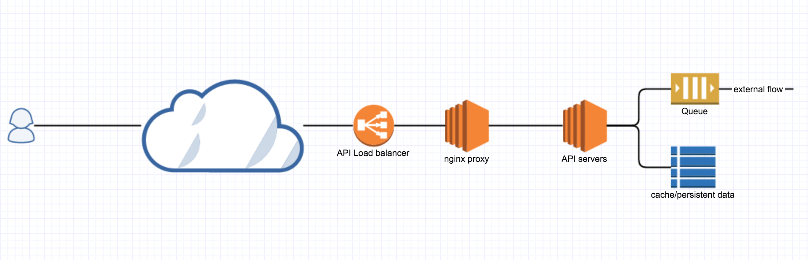
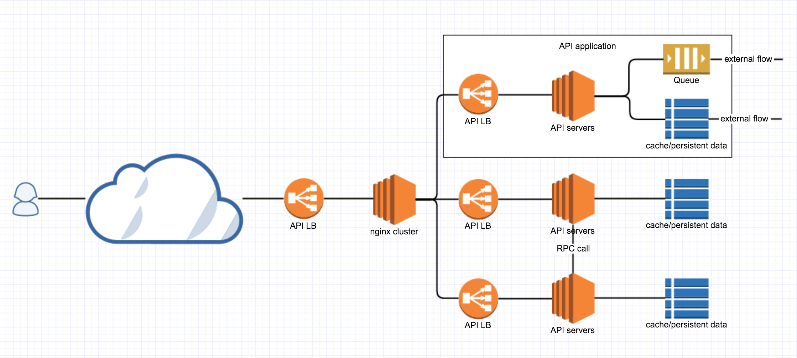
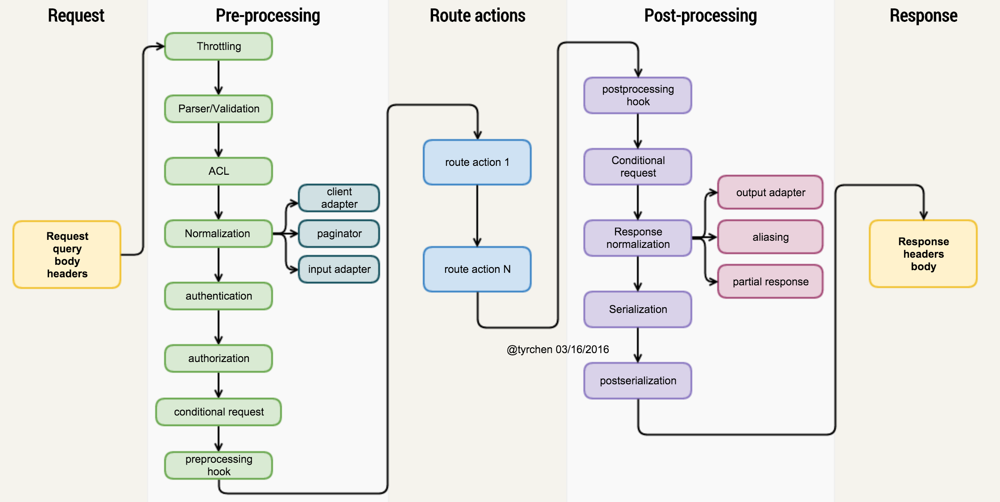
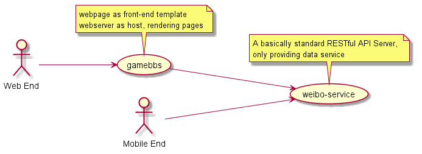

## 2016 年终技术分享
#### 构建合格的 API Server & 一些值得关注的新技术
<br />
<p>
  <small>by <a target="_blank" href="http://maples7.com">Maples7</a></small><br />
	<small>2017.1</small>
</p>


## 项目回顾    

- 游戏论坛（微博） <!-- .element: class="fragment" data-fragment-index="1" -->
	- 落实到实现细节的 Node 实践，学到很多
<br /><br />
- DC2016 / IF2017 <!-- .element: class="fragment" data-fragment-index="2" -->
	- 自动化测试的重要性
<br /><br />
- DC <!-- .element: class="fragment" data-fragment-index="3" -->
	- 项目起始进行合理架构和规划的重要性

Note:
游戏论坛：至今对我的编码实践有很重要的影响，奠定了一个好的技术观，至少能认清代码的孰好孰坏，能辨明技术发展的方向；

DC2：像薛学长所说，重构人员没有对业务充分了解，所谓重构完全是翻译源代码（.net -> .net core），我们专项小组完全沦为给这个项目做手动测试的 Postman，这样的重构毫无意义。而且，理论上，任何改动都需要对所有接口测试一遍，十分低效，所以深刻认识到要写自动化测试！

DC：老！比我第一次写 PHP 时的版本还要老，代码充斥着不规范的写法和被 Depreciated 的特性，没有经过合理的架构和设计，完全的同步阻塞的面向过程的写法。矛盾：游戏需求多杂乱，代码被几十万人使用，代码内的业务逻辑混乱到几乎没有人能完全厘清，Leader 也不会有重构的勇气，项目技术债务高筑，几乎几经达到了可维护的临界值。


## [构建一个合格的 RESTful API Server](http://maples7.com/2016/09/05/build-qualified-restful-api-server/)


## Objectives

- Indirection & pipeline
- RESTful & HTTP(S)
- Validation, document & auto-test
- Security & throttling
- Introspection
- Scalable
- ……


## 架构






<small class="fragment">图片来源：<a href="https://zhuanlan.zhihu.com/p/20691649">https://zhuanlan.zhihu.com/p/20691649</a></small>


## Process Pipeline


<small class="fragment">图片来源：<a href="https://zhuanlan.zhihu.com/p/20691649">https://zhuanlan.zhihu.com/p/20691649</a></small>


## Protocol Done Right

- REST 
  - GET, POST, PUT, PATCH, DELETE
<br /><br />
- HTTP Headers
	- Accept(content type negotiation), If-Modified-Since/If-None-Match, If-Match/If-Modified
<br /><br />
- HTTP Status Code
	- 2XX, 3XX, 4XX, 5XX


## Security & Validation

- Authentication
	- 使用 token（JWT）而不是 Session 进行验证
<br /><br />
- Authorization & ACT(Access Control List)
	- **什么人** 可以做 **什么事**
  - HTTP BASIC Auth，OAuth，HMAC Auth......
<br /><br />
- Data Validation
	- 请求的 Header, URL, Body 及其参数类型、范围、长度等等都是否合法
<br /><br />
- HTTPS


## Conditional Request & Throttling

- Conditional Request
	- If-Match/If-Modified(If-None-Match/If-Not-Modified)
	- 作用：
		- 304
		- 数据改动的并发控制
<br /><br />
- Throttling
	- 防止 DOS 和 Replay 攻击


## Normalization

- Request
	- Client Adapter
	- Paginator
	- Input Data Adapter
<br /><br />
- Response
	- Output Data Adapter
	- Aliasing
	- Partial Response


## Hooks

- preprocessing 
- postprocessing
<br /><br />
- Koa 的「洋葱体」结构


## 技术选型

- Web Framework 
	- Express/FeathersJS/Hapi/Restify, Django/Flask, Plug/Phoenix……
<br /><br />
- ORM 
	- Sequelize, Mongoose, Waterline……
<br /><br />
- Document 
	- [Swagger](http://maples7.com/2016/09/06/build-doc-system-of-express-api-server-with-swagger/), RAML, API Blueprint, apidoc……
<br /><br />
- Data Validation 
	- Swagger 插件, joi, JSON Schema……


## 技术选型

- Test Framework 
	- ava/rewire/supertest/nyc
	- mocha/should(chai)/supertest/istanbul
<br /><br />
- Log System
	- ELK, bunyan, log4js, morgan……
<br /><br />
- Message Queue
  - kafka, rabbitMQ……
<br /><br />
- ……


## 「编译时」与「运行时」

<br />
- 自动化文档？输入参数验证？自动化测试？
<br /><br />
- 写一个 Parser！
	- RegExp?
	- Parser Generator: instaparse(Clojure), Jison(JavaScript), antlr4, parsec(Haskell)
<br /><br />
- 不要重复定义！保证文档和代码的一致性！


## 推荐阅读

- [撰写安全合格的REST API](https://zhuanlan.zhihu.com/p/20034107)
- [再谈 API 的撰写 - 总览](https://zhuanlan.zhihu.com/p/20691602)
- [再谈 API 的撰写 - 架构](https://zhuanlan.zhihu.com/p/20691649)
- [再谈 API 的撰写 - 子系统](https://zhuanlan.zhihu.com/p/20691777)
- [再谈 API 的撰写 - 契约](https://zhuanlan.zhihu.com/p/20691806)
- [谈谈编译和运行](https://zhuanlan.zhihu.com/p/20691721)
- [如何愉快地写个小parser](https://zhuanlan.zhihu.com/p/20178871)


## 一些值得一提的新技术


## GraphQL

- 建立接口参数的数据模型，并让**前端**来决定它需要的信息
	- 所有返回数据的一个子集
	- 作用：
		- 减少 HTTP 调用
		- 减轻后端的负担（文档、参数验证、统一数据返回、序列化等）
<br /><br />
- Google+ API: [Partial Response](https://developers.google.com/+/web/api/rest/#partial-response)


## [FeathersJS](https://docs.feathersjs.com/testing/readme.html)

- Realtime: Socket.io, Primus
<br /><br />
- _Very Easy_ to use, compared with Express
	- Unfair, it's based on Express and have good **encapsulation** and **CLI**
<br /><br />
- 对关键问题的处理方法十分标准
	- the most important thing!


## Yarn

- Fast with Cache
<br /><br />
- Precise
<br /><br />
- Compatible
  - the most successful point!


## Erlang/Elixir/Phoenix

- Very Well-Designed language
<br /><br />
- Functional Promgamming
	- Neat, clean and graceful
<br /><br />
- Born Concurrency, Pattern Matching, Hot Reload
<br /><br />
- 强大的工具链


## 推荐一些小工具


## PlantUML



## [devdocs.io](http://devdocs.io/)


## [codelf](https://unbug.github.io/codelf/)
<br />
### There are only two hard things in Computer Science: cache invalidation and naming things.
#### —— Phil Karlton


## [node-modules.com](http://node-modules.com/)


## Zsh, oh my zsh, babun


## Transfer to ES6/7


## const & let

- Use _const_ for all of your references; avoid using _var_.
- If you must reassign references, use _let_ instead of _var_.
- _typeof_ is no longer safe because of _Temporal Dead Zones (TDZ)_.


## Use computed property

```js
function getKey(k) {
  return `a key named ${k}`;
}

// bad
const obj = {
	id: 5,
	name: 'San Francisco',
};
obj[getKey('enabled')] = true;

// good
const obj = {
	id: 5,
	name: 'San Francisco',
	[getKey('enabled')]: true,
};
```


## Use shorthand

```js
// bad
const atom = {
	value: 1,

	addValue: function (value) {
		return atom.value + value;
	},
};

// good
const atom = {
	value: 1,

	addValue(value) {
		return atom.value + value;
	},
};
						
// ---------------------------

const lukeSkywalker = 'Luke Skywalker';

// bad
const obj = {
  lukeSkywalker: lukeSkywalker,
};

// good
const obj = {
  lukeSkywalker,
};
```


## Use rest operator

```js
// bad
const original = { a: 1, b: 2 };
const copy = Object.assign({}, original, { c: 3 }); // copy => { a: 1, b: 2, c: 3 }

// good
const original = { a: 1, b: 2 };
const copy = { ...original, c: 3 }; // copy => { a: 1, b: 2, c: 3 }

const { a, ...noA } = copy; // noA => { b: 2, c: 3 }

// ---------------------------

// bad
const len = items.length;
const itemsCopy = [];
let i;

for (i = 0; i < len; i += 1) {
	itemsCopy[i] = items[i];
}

// good
const itemsCopy = [...items];

// ---------------------------

// bad
function concatenateAll() {
	const args = Array.prototype.slice.call(arguments);
	return args.join('');
}

// good
function concatenateAll(...args) {
	return args.join('');
}

// ---------------------------

// bad
const x = [1, 2, 3, 4, 5];
console.log.apply(console, x);

// good
const x = [1, 2, 3, 4, 5];
console.log(...x);

// bad
new (Function.prototype.bind.apply(Date, [null, 2016, 08, 05]));

// good
new Date(...[2016, 08, 05]);
```


## Destructuring

```js
// bad
function getFullName(user) {
	const firstName = user.firstName;
	const lastName = user.lastName;

	return `${firstName} ${lastName}`;
}

// good
function getFullName(user) {
	const { firstName, lastName } = user;
	return `${firstName} ${lastName}`;
}

// best
function getFullName({ firstName, lastName }) {
	return `${firstName} ${lastName}`;
}

// ---------------------------

const arr = [1, 2, 3, 4];

// bad
const first = arr[0];
const second = arr[1];

// good
const [first, second] = arr;

// ---------------------------

// bad
function processInput(input) {
	// then a miracle occurs
	return [left, right, top, bottom];
}

// the caller needs to think about the order of return data
const [left, __, top] = processInput(input);

// good
function processInput(input) {
	// then a miracle occurs
	return { left, right, top, bottom };
}

// the caller selects only the data they need
const { left, top } = processInput(input);

// ---------------------------

// really bad
function handleThings(opts) {
	// No! We shouldn't mutate function arguments.
	// Double bad: if opts is falsy it'll be set to an object which may
	// be what you want but it can introduce subtle bugs.
	opts = opts || {};
	// ...
}

// still bad
function handleThings(opts) {
	if (opts === void 0) {
		opts = {};
	}
	// ...
}

// good
function handleThings(opts = {}) {
	// ...
}
```


## Arrow Functions

```js
// bad
[1, 2, 3].map(function (x) {
	const y = x + 1;
	return x * y;
});

// good
[1, 2, 3].map((x) => {
	const y = x + 1;
	return x * y;
});

// ---------------------------

// bad
[1, 2, 3].map(number => {
	const nextNumber = number + 1;
	`A string containing the ${nextNumber}.`;
});

// good
[1, 2, 3].map(number => `A string containing the ${number}.`);

// good
[1, 2, 3].map((number) => {
	const nextNumber = number + 1;
	return `A string containing the ${nextNumber}.`;
});

// good
[1, 2, 3].map((number, index) => ({
	[index]: number
}));
```


## Class


#### Always use _class_ rather than manipulating _prototype_ directly.

```js
// bad
function Queue(contents = []) {
	this.queue = [...contents];
}
Queue.prototype.pop = function () {
	const value = this.queue[0];
	this.queue.splice(0, 1);
	return value;
};

// good
class Queue {
	constructor(contents = []) {
		this.queue = [...contents];
	}
	pop() {
		const value = this.queue[0];
		this.queue.splice(0, 1);
		return value;
	}
}
```


#### Use _extends_ for inheritance.

```js
// bad
const inherits = require('inherits');
function PeekableQueue(contents) {
	Queue.apply(this, contents);
}
inherits(PeekableQueue, Queue);
PeekableQueue.prototype.peek = function () {
	return this._queue[0];
}

// good
class PeekableQueue extends Queue {
	peek() {
		return this._queue[0];
	}
}
```


## 编程指导理念


## Code First or Model First?


## Principles

- DRY - Don't Repeat Yoursel
- OCP - Open Close Principle
- SoC - Separation of Concerns
- IoC - Inversion of Control
- CoC - Configuration over Convention


## Indirection / Layering
#### the most important guideline of software developing


### All problems in computer science can be solved by another level of indirection.
#### —— David Wheeler


## Thank You
#### [maples7.com](http://maples7.com)
