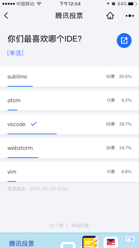
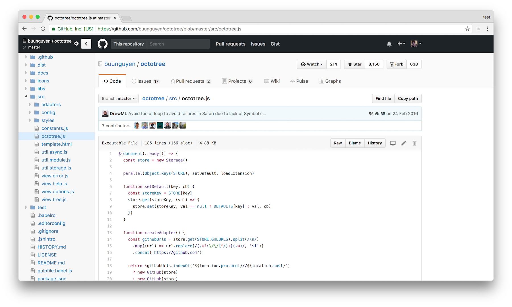
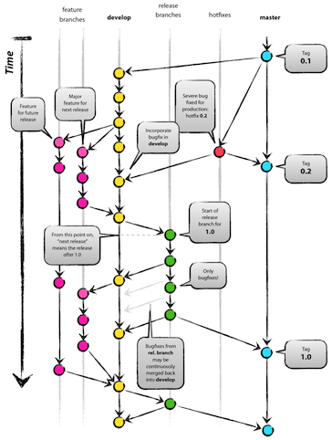
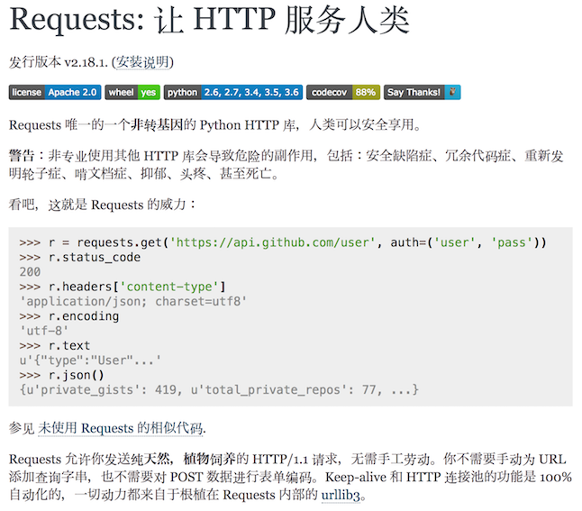

## 2017 秋季技术分享
#### [软件开发的工程化思考与实践「乱炖」](http://slides.maples7.com/2017-9.html)
<br />
<p>
  <small>by <a target="_blank" href="http://maples7.com">Maples7</a></small><br />
	<small>2017.9</small>
</p>


## 1. 选择编辑器

- Editor or IDE? <!-- .element: class="fragment" data-fragment-index="1" -->

- Vim and Emacs <!-- .element: class="fragment" data-fragment-index="2" -->

- <!-- .element: class="fragment" data-fragment-index="3" --> [VSCode](https://code.visualstudio.com/) <!-- .element: class="fragment" data-fragment-index="3" -->

Note:
<small>
一个跟「世界上最好的语言是什么」一样可以引发社区「战争」的话题。
其实没有太多可以说的东西，更多只是被安利之后自己在使用过程中去体会，到底怎么样其实是一件「冷暖自知」的事情。

IDE or Editor? 之前也喜欢高大全的东西——用 VS，什么语言写起来都很爽。后来慢慢开始喜欢小而美的东西，一个个小而专一的组件，经过人为的合理编排，像搭乐高一样搭起来，每个组件都发挥它最大的价值。

软件工程很多时候也是如此，核心在于选择符合实际情况的东西，每一个组件都各有各的特点，它们也是各种权衡、各种做 trade-off 的结果，就像 IDE 功能全面省心，但是启动速度就比较慢，很多功能其实可能永远都用不到，那这些用不到的部分其实在你实际使用的过程中不但不会成为优势，反而会成为一种负担。写代码的追求也是如此，每一行代码都发挥它们最大的价值，找到一个抽象层级平衡的点，不多不少。

上古时代的神器：Vim and Emacs，编辑器之神 和 神的编辑器。在服务器环境用得到，还需更多的学习和使用。

VSCode：2016.3 推出 1.0 版本，上手简单，使用 Electron 技术，继承的是 Web 开发的理念而不是桌面端开发的理念，所以迭代更新速度很快。使用过程中慢慢熟悉快捷键，选择一些合适的插件。尤其适合前端开发。
</small>




Note:
<small>
justjavac（上一周刚生了一个女儿）拉的一个 Node 开发群的投票。
</small>


## 2. Tips for [Node](https://nodejs.org/) Development


## [Prettier](https://github.com/prettier/prettier)
<br />
"Prettier is an opinionated code formatter."

"Prettier enforces a consistent code style across your entire codebase."

Note:
<small>
会解析抽象语法树（AST）然后 re-print，保证同样的代码会有同样的 format。
</small>


## [nvm](https://github.com/creationix/nvm) + [nrm](https://github.com/Pana/nrm)
<br />
"Node Version Manager - Simple bash script to manage multiple active node.js versions"

"NPM registry manager, fast switch between different registries: npm, cnpm, nj, taobao"


## [husky](https://github.com/typicode/husky)
<br />
"Git hooks made easy"

"Husky can prevent bad commit, push and more 🐶 woof!"

Note:
<small>
pre-commit hook 保证提交之前运行 lint/format/test，防止坏代码污染远端代码库。

传统手动写 git pre-commit hook 的问题是针对个人本地的，无法与团队共享，尤其是如果项目中期再加入，还可能遭到团队排斥。
husky 在 npm install 的时候注入 hook。
</small>


## Recommended Structure for [MVC](https://zh.wikipedia.org/wiki/MVC) Project

```js
.
├── bin             // 命令行脚本
├── config          // 项目配置文件
├── controllers     // 控制器 Controllers
├── doc             // 项目文档
├── enums           // 项目常量
├── lib             // 公共函数库
├── middlewares     // 中间件 
├── models          // 模型层 Models
├── node_modules    // Node.js 依赖目录
├── proxy           // 代理层，用于封装与其他项目的交互接口
├── public          // 静态文件 Views
├── routes          // 路由
├── servers         // 服务启动入口
├── services        // 服务层，具体业务在这里实现
├── test            // 测试
├── tools           // 工具-与业务有关
└── utils           // 工具-与业务无关
```


## 3. Tips for [Python](https://www.python.org/) Development


## [YAPF](https://github.com/google/yapf)
<br />
"In essence, the algorithm takes the code and **reformats it to the best formatting** that conforms to the style guide, even if the original code didn't violate the style guide."


## [Anaconda](https://www.anaconda.com/distribution/)?
## Give [pyenv](https://github.com/pyenv/pyenv) + [pipenv](https://github.com/kennethreitz/pipenv) a chance...

Note:
<small>
- pyenv 相当于 nvm，在同一个主机上管理 Python 的多个版本环境。
- pipenv 相当于 npm，但是还可以为每个项目建立独立的运行环境。会生成一个类似于 package.json 的文件声明项目依赖，用同样的工具就可以多平台移植，直接 `pipenv install` 一下就可以了。
</small>


## 4. A Few Solid Universal Development Tips


## [codelf](https://unbug.github.io/codelf/)
<br />
### There are only two hard things in Computer Science: cache invalidation and naming things.
#### —— Phil Karlton

Note:
<small>
注意右上角还可以管理你的 GitHub 上 Star 过的项目，可以分组、可以加标签等等。
</small>


## [devdocs.io](http://devdocs.io/)

Note:
<small>
类似于 macOS 上的 Dash，文档的集合，还有版本管理，告别一大堆零散的浏览器书签。
</small>


## [Github Gist](https://gist.github.com/)

Note:
<small>
简洁高效的随手记录工具
</small>


## [Octotree](https://github.com/buunguyen/octotree)




## [git submodule](https://git-scm.com/book/en/v2/Git-Tools-Submodules)

Note:
<small>
- 解决的问题：某个工作中的项目需要包含并使用另一个项目。也许是第三方库，或者你独立开发的，用于多个父项目的库。现在问题来了：你想要把它们当做两个独立的项目，同时又想在一个项目中使用另一个。
- 最近的应用场景：kong-mock-server, celery crawler 下属的 worker
</small>


## [A successful Git branching model](http://nvie.com/posts/a-successful-git-branching-model/)



Note:
<small>
master 和 develop 是永久分支，其他都是临时分支。

- hotfix: 针对线上的一些紧急修复的 bug
- feature: 大的功能、新特性增加
- release: 预发布版本，一般用于上线前最后的测试
</small>


## [语义化版本 2.0.0](http://semver.org/lang/zh-CN/)

- 版本格式：主版本号.次版本号.修订号

- 版本号递增规则如下：
    - 主版本号：当你做了不兼容的 API 修改
    - 次版本号：当你做了向下兼容的功能性新增
    - 修订号：当你做了向下兼容的问题修正


## 5. How to Write A Pretty README


## [art-of-readme](https://github.com/noffle/art-of-readme)


- Your job is to:

    1. tell them what it is (with context)
    2. show them what it looks like in action
    3. show them how they use it
    4. tell them any other relevant details

Note:
<small>
另外，写 README 要照顾到阅读者的「认知漏斗」，从上往下逐步出现越来越详尽的细节。Celery 的文档写的中规中矩，但这一点上做得不是很好。
</small>


- Checklist:

    - One-liner explaining the purpose of the module
    - Necessary background context & links
    - Potentially unfamiliar terms link to informative sources
    - Clear, runnable example of usage
    - Installation instructions
    - Extensive API documentation
    - Performs cognitive funneling
    - Caveats and limitations mentioned up-front
    - Doesn't rely on images to relay critical information
    - License

Note:
<small>
- 一句话解释模块的目的
- 必要的背景资料或链接
- 为潜在不熟悉的术语提供到信息来源的链接
- 简洁可运行的实例
- 安装说明
- 详细的API文档
- 对认知漏斗的执行
- 前面提到的注意事项和限制
- 不要依赖图片传递关键信息
- 许可证
</small>





## [common-readme](https://github.com/noffle/common-readme)

Note:
<small>
根据 pacakge.json 里的信息自动生成一个良好结构的 README 模板
</small>


## 6. 编程范式
<br />
### 面向对象编程 vs. 函数式编程 <!-- .element: class="fragment" data-fragment-index="1" -->

Note:
<small>
个人经验：写封装好的工具包或者框架适合使用面向对象编程，开发 API Server 写纯后端业务适合函数式编程

原因：
每一个请求的生命周期很短，保留状态容易引发并发问题和竞态条件（Race Condition），无状态的函数式编程更合适。

「在某些架构中，典型代表是web应用，大量Python进程实例被产生以响应可能同时到达的外部请求。在这种情况下，在实例化对象内保持某些状态，即保持某些环境静态信息，容易出现并发问题或竞态条件。有时候在对象状态的初始化(通常通过 __init__() 方法实现)和在其方法中使用该状态之间，环境发生了变化，保留的状态可能已经过时。举个例子，某个请求将对象加载到内存中并标记它为已读。如果同时另一个请求要删除这个对象，删除操作可能刚好发生在第一个请求加载完该对象之后，结果就是第一个请求标记了一个已经被删除的对象为已读。」

「这些问题使我们产生一个想法：使用无状态的函数是一种更好的编程范式。另一种建议是尽量使用隐式上下文和副作用较小的函数与程序。函数的隐式上下文由函数内部访问到的所有全局变量与持久层对象组成。副作用即函数可能使其隐式上下文发生改变。如果函数保存或删除全局变量或持久层中数据，这种行为称为副作用。」

来自 https://pythonguidecn.readthedocs.io/zh/latest/writing/structure.html#id12
</small>


## 7. 工程化思想


- DRY - Don't Repeat Yourself <!-- .element: class="fragment" data-fragment-index="1" -->
- OCP - Open Close Principle <!-- .element: class="fragment" data-fragment-index="2" -->
- SoC - Separation of Concerns <!-- .element: class="fragment" data-fragment-index="3" -->
- IoC - Inversion of Control <!-- .element: class="fragment" data-fragment-index="4" -->
- CoC - Configuration over Convention <!-- .element: class="fragment" data-fragment-index="5" -->

Note:
<small>
主要的一些原则，像 Unix 哲学中单一职责这些都知道的就不说了。

- 不要重复，不要写出意大利面条式的代码。
- 开闭原则：对扩展开放，对修改封闭。比如某个处理各种消息类型的函数，添加一种新的消息类型时不必修改主函数。解决的办法可以是给每个消息类型都传递自己特有的回调函数，或者用观察者模式彻底解耦都可以。关键在于解耦。
- 关注点分离：另一个方面的解耦，比如 MVC 模式、模板引擎分离过去 PHP 典型的 HTML 和数据、Parser 将数据和程序逻辑流程分离。
- 控制反转。核心思想是 "Don't call me, I'll call you"（也叫好莱坞原则，好莱坞经纪人的口头禅）。回调最大的问题不在于 Callback Hell，而在于回调函数的调用没法得到有效控制。Promise 等各种异步流程管理库基本都是利用控制反转来使得程序流程能有效的控制在自己的手中的。
- 约定优于配置，也叫作按约定编程，它的意思是：为了简单起见，我们写代码按照一定的约定写（代码放在什么目录，用什么文件名，用什么类名等），这样省去了很多不必要的麻烦（但也不失flexibility，因为约定可以通过配置修改）。以前写过一个自动加载路由的包就是为了遵循这个原理（自动从约定的地方加载路由规则，省去很多定义路由的代码）。这样其实是增加了「约束」。
</small>


## 「约束」与「兼容」

Note:
<small>
一些个人经验：框架等偏底层的东西考虑的应该是多一些**约束**（这样团队协作中才能写出易读易理解的好代码），而第三方工具库、包这些东西则应该多一些**兼容**，接口应该考虑更多的调用方式。

约束对编程有时候其实是一件好事，一个个人的不成熟的瞎想：解释型语言相比编译型语言（脚本语言）缺少约束、而强类型约束严格（一般的解释型的都是弱类型），Python 将这两点中和得很好，所以约束得恰到好处，用起来就很受欢迎。
</small>


## 「编译时」与「运行时」

Note:
<small>
区分「编译时」和「运行时」（至少有这样的理念）非常重要。可以用做菜来比喻编程，「编译时」就是准备各种材料——洗菜切菜捣蒜之类的，「运行时」就是正式开火做菜的阶段。「编译时」可以做很多重要的事情，适合进行代码的内省（编译型语言相对于解释型语言的一大优势）等等。静态站点生成器（Hexo）、我用 Reveal.js 做的这个 Slide 都是如此。都是 Parser，而 Parser 无处不在。

原理上来说，就是在代码运行之前，对代码先进行解析，获取必要的信息。

自动加载路由的包其实也是在「编译时」加载路由，运行时路由规则是在内存里面的。
</small>


## Indirection / Layering
#### the most important guideline of software developing


### All problems in computer science can be solved by another level of indirection.
#### —— David Wheeler

Note:
<small>
David Wheeler: 英国计算机科学家，世界上第一个获得计算机 PhD 学位的人，剑桥大学三一学院
</small>


## Thank You
#### [maples7.com](http://maples7.com)


## 一些其他推荐

- [软技能 · 代码之外的生存指南](https://book.douban.com/subject/26835090/)
- [代码时间 Podcast](http://codetimecn.com/)
    - [内核恐慌 Podcast](https://kernelpanic.fm/)
    - [Teahour FM](http://teahour.fm/)
    - [IT 公论 Podcast](https://ipn.li/itgonglun/)
