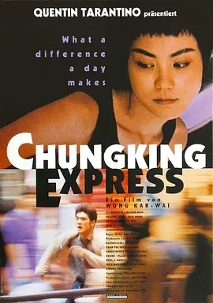

## Childhood

#### 1994 ～ 2009

Note:
For Childhood

<!-- .slide: data-background-iframe="https://www.google.com/maps/embed?pb=!1m18!1m12!1m3!1d444570.6137102581!2d112.39333314098128!3d29.481131399012867!2m3!1f0!2f0!3f0!3m2!1i1024!2i768!4f13.1!3m3!1m2!1s0x3427f903d5c3a987%3A0x1527eac40284ca59!2sHuarong%20County%2C%20Yueyang%2C%20Hunan%2C%20China!5e0!3m2!1sen!2s!4v1659771342868!5m2!1sen!2s" -->

Note:
I was born in a small county of Hunan province. It is located in the northernmost part of Hunan Province, adjacent to Hubei Province. As you can see, it's surrounded by many lakes and rivers in the area, which is pretty similar to Suzhou. The most famous ones are Dongting Lake and Yangtze River.

I had a carefree and happy childhood. I studied in several different schools as my parents' job transfers and I made many friends in my schooldays. I didn't have to study too hard to get good grades in school. Till my middle school, I've become one of the best students in the small county.

## Education

### High School
<!-- .slide: data-background-image="resource/img/2022-8/changjun-school.jpg" -->

#### 2009 ～ 2012

 <!-- .element: class="fragment" data-fragment-index="1" style="max-width: 25%;" data-transition="fade-in" -->
    

Note:
Since I did pretty well in middle school, after the second year of middle school, I got admitted to one of the best high school in Hunan province or even one of the best in China - Changjun High School, which is located in downtown area of Changsha city.

It's there that I started to write code. In the first year, I spent a lot of time on NOIP - National Olympiad in Informatics in Provinces, it's like ACM for high school students. I was so into programming that I didn't even realize that. My first programming language was Pascal, I still remember the blue background of Turbo Pascal, and you type code and compile code in it. But the good times don't last long. My parents and my class tutor think NOIP is too time consuming and I've fallen too far behind in other subjects. So I quit NOIP as their suggestions. It's a pretty tipical Chinese style story. The rest two years are quite boring just like other high school students, study hard to prepare for the National College Entrance Examination or 高考. And I did really not so well in that exam.

### University
<!-- .slide: data-background-image="resource/img/2022-8/shandong-university.jpg" -->

#### 2012 ～ 2016

 <!-- .element: class="fragment" data-fragment-index="1" style="max-width: 25%;" data-transition="fade-in fade-out" -->
 <!-- .element: class="fragment" data-fragment-index="2" style="max-width: 25%;" data-transition="fade-in fade-out" -->
 <!-- .element: class="fragment" data-fragment-index="3" style="max-width: 25%;" data-transition="fade-in fade-out" -->

Note:
After high school, I went to Shandong University majoring in Electrical Engineering. I had many expectations for university life but I quickly realized that it was just another bigger high school. Students study hard to get good grades for a good job basically. But that's not what I wanted. After the experience of high school, I realized my parents were not always make decisions suitable for me. I started to follow my inner voice and made my own decisions. After the first year, I clearly realized that I didn't like my major and I was tired of the cliche in many courses. Also I didn't want to work for the State Grid Corporation of China or 国家电网 after graduation. So I actually didn't put much effort into my major but just learned some basics to ensure I could pass all the tests and exams.

Fortunately, I joined an organization called Student Online (Shen probably knows it) in university, it's like a startup but we don't have to worry about how to make money. Our users are students in university and we basically have no limitations to fulfill our ideas. That's very cool. That's where I started to do backend development and used PHP and Python to write some web applications. It's a good experience and I also made some lifelone close friends there.

It's unbeliveable I still had hair at that time.

## Career

#### 2016 ～ Now

- <!-- .element: class="fragment" data-fragment-index="1" --> Duoyi Network, Guangzhou 
<!-- .element: class="fragment" data-fragment-index="1" -->
  
- <!-- .element: class="fragment" data-fragment-index="2" --> Seniverse, Beijing 
<!-- .element: class="fragment" data-fragment-index="2" -->
  
- <!-- .element: class="fragment" data-fragment-index="3" --> Microsoft, Suzhou 
<!-- .element: class="fragment" data-fragment-index="3" -->

Note:
After graduation, I joined a game company in Guangzhou. The company is so-so but I've met a good tech leader, who was very strict about code quality. I've laid a good foundation on JavaScript and Node.js during that time. JavaScript is probably not a well-designed programming language, but its tech community is absolutely the best. The community is full of innovative geekers and they're usually active in creating something new and they're willing to share their knowledge. I quit the job after the tech leader left the company and joined a startup in Beijing called Seniverse.

This is a company focusing on weather/meteorological business. The team is so great and everyone is creative and professional. Coincidentally, my boss - the CEO - used to be a senior PM in Microsoft Redmond before he founded the company. Gradually I became the head of backend development and had many chances to try my ideas. I mainly write Node.js, Python and Elixir/Erlang there. Elixir or Erlang is a good but niche language. I worked in Beijing for three years.

After that, I joined Microsoft and it's the story with you guys.

## Hobbies

“It's the curiosity that drives me. It's making a difference in the world that prevents me from ever giving up.”

― [Deborah Meier](https://en.wikipedia.org/wiki/Deborah_Meier)

Note:
I have many hobbies, I still think it's curiosity that drives me to live. I can talk a little bit on movies and photography today.

(Deborah Meier (born April 6, 1931) is an American educator often considered the founder of the modern small schools movement.)

### Movies
<!-- .slide: data-background-video="resource/video/2022-8/movie-background.mp4" data-background-video-loop data-background-video-muted data-background-opacity="0.8"-->

 <!-- .element: class="fragment" data-fragment-index="1" style="max-width: 25%;" data-transition="fade-in fade-out" -->
 <!-- .element: class="fragment" data-fragment-index="2" style="max-width: 21.15%;" data-transition="fade-in fade-out" -->
 <!-- .element: class="fragment" data-fragment-index="3" style="max-width: 22%;" data-transition="fade-in fade-out" -->

Note:
my favorite movie director is David Fincher, he is pretty much like a geeker and has the hacker spirit. He directed my favorite movie The Social Network. My favorite Chinese movie is Chungking Express/重庆森林, directed by Kar Wai Wong (王家卫).

### Photography <!-- .element: style="margin: 0" -->

 <!-- .element: style="max-width: 23%; margin: 0" -->
 <!-- .element: style="max-width: 23%; margin: 0" -->
 <!-- .element: style="max-width: 23%; margin: 0" -->
 <!-- .element: style="max-width: 23%; margin: 0" -->
 <!-- .element: style="max-width: 15%; margin: 0" -->
 <!-- .element: style="max-width: 15%; margin: 0" -->
 <!-- .element: style="max-width: 15%; margin: 0" -->
 <!-- .element: style="max-width: 15%; margin: 0" -->
 <!-- .element: style="max-width: 15%; margin: 0" -->
 <!-- .element: style="max-width: 15%; margin: 0" -->

Note:
For photography, you may have known it. I have shared many photos on WeChat Moments. I'm definitely not a professional photographer, I just like taking photos. These are a few ones taken by me. Alongwith taking photos, I also like to travel and explore new places.

## Thank you!

[Blog](https://maples7.com/) |
[GitHub](https://github.com/Maples7) |
[豆瓣](https://www.douban.com/people/MaplesSeven/) |
[图虫](https://maples7.tuchong.com/) |
[Weibo](https://weibo.com/u/3888197280) |
[知乎](https://www.zhihu.com/people/maples7)
<!-- .element: style="font-size: 20px" --> 

## Next Host <!-- .slide: data-auto-animate -->

Note: So, that's all for my ordinary life. For next host,

## Next Host <!-- .slide: data-auto-animate -->

### Any volunteer?

Note: any volunteer?

## Next Host <!-- .slide: data-auto-animate -->

### Any volunteer?

### If not, I'll nominate...

## Next Host <!-- .slide: data-auto-animate -->

### Any volunteer?

### If not, I'll nominate...

# Zhenyu Xu

# Games!
<!-- .slide: data-background-image="resource/img/2022-8/splendor.jpg" data-background-opacity="0.25" -->

- UNO, 3~10 people, F61
- Avalon, 5~10 people, F62
- Splendor, 2~6 people, F63
- Werewolf, 7~20 people, F65

Note:
I've prepared some board games for you guys. We have these ones and feel free to join anyone you like. I high recommend Splendor and I'll personally join this one.

So, that's all! Have fun!
